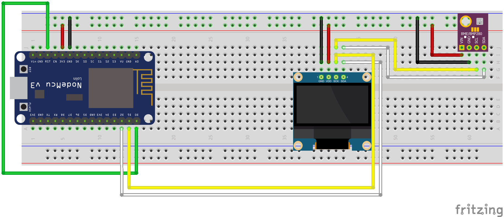

Meteo Station
=============

Simple example of meteo station implemented in [MicroPython](https://micropython.org/) using NodeMCU (ESP8266), Bosch BME280 and 0.96" OLED display.

It takes values (temperature, pressure and humidity) from BME280 sensor, sends them to ThingSpeak cloud, shows values on the display and sleeps for 5 min before next measurement. 

## Prerequirements

* NodeMCU (ESP8266)
* Bosch BME280 sensor (temperature, pressure, humidity)
* 0.96" (128x64) OLED display on SSD1306
* Account on [ThingSpeak](https://thingspeak.com) (it's free)

## Wiring

Do not forget to connect `D0` to `RST` as it is required for awakening from deep sleep.

## ThingSpeak

You need a chanel with 3 fields defined:

1. Temperature in °C
2. Pressure in Pa
3. Humidity in %

## Setup

Run `make` to download dependencies (`bme280.py` and `urllib.urequest`) which will be downloaded to `lib` directory.

Copy `config.py.in` to `config.py` and edit it with your WiFi credentials and ThingSpeak's API key.

Upload next files to the board:

* `lib/bme280.py`
* `lib/urllib/urequest.py`
* `config.py`
* `main.py`

You may use [rshell](https://github.com/dhylands/rshell) to do this:

    rshell --port <PORT_PATH> cp -r lib config.py main.py /pyboard/

Before files upload wire `D0` -> `RST` should be temporary disconnected as those pins are used during this operation.